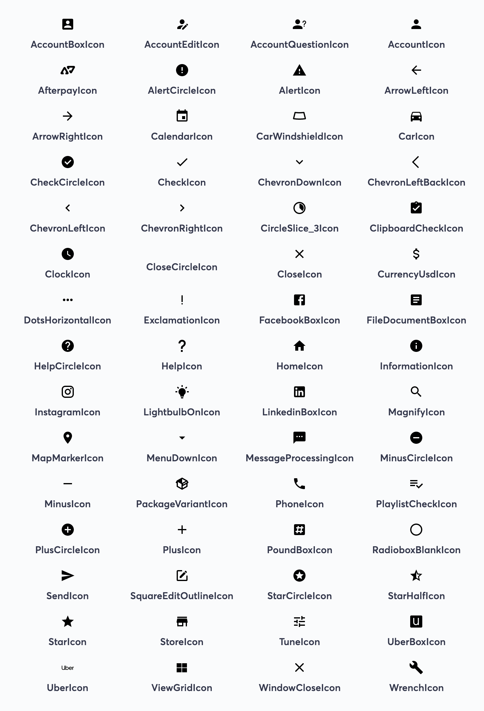

# @autoguru/icons

### Install

```sh
yarn add @autoguru/icons \
    react
```

### Usage

```jsx
import { AccountBoxIcon } from '@autoguru/icons';
import { Icon } from '@autoguru/overdrive';

<Icon icon={AccountBoxIcon} size={16} />
```

### Icons




### Contributing

> For now this is quite manual.

Even though you we run `svgo` over the files before we generate the components, we want our source to be quite clean too. At this stage, please optimize this before you raise the pull request.  
